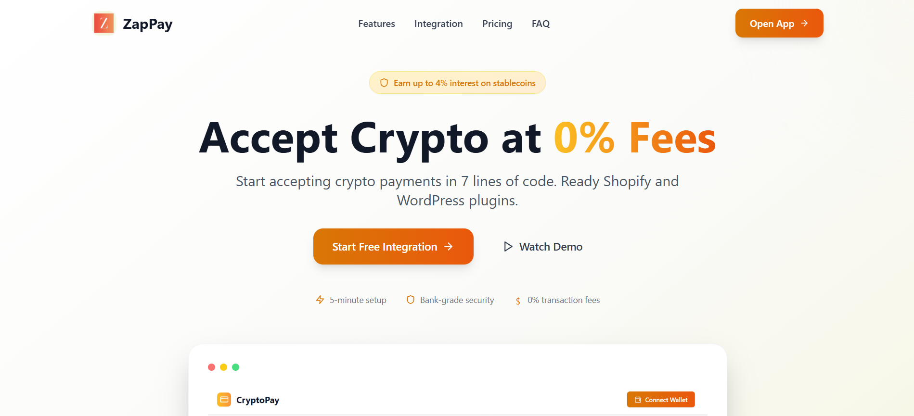

# ZapPay 💳⚡

> **The first 0% transaction fee Web3 payment gateway with built-in AI-powered fraud detection**

ZapPay is a comprehensive cryptocurrency payment platform built on the x402 protocol, providing a Stripe-like experience for merchants to accept crypto payments with zero fees. Extended with real-time blocking, advance fraud detection, Machine learning risk analysis, and merchant dashboard capabilities.



## 🌟 Key Features

- **🎯 Zero Transaction Fees**: Built on x402 protocol for feeless crypto payments
- **🤖 AI-Powered Fraud Detection**: Machine learning models (Random Forest + XGBoost) with 97% accuracy
- **🔒 Real-Time Risk Analysis**: Multi-layer wallet scoring (ML + Rules + AML checks)
- **🚫 Wallet Blacklist**: Automatic blocking of high-risk addresses
- **📊 Merchant Dashboard**: Complete payment management interface
- **💰 Multi-Chain Support**: Currently supports Base Sepolia, Scroll Sepolia (easily extensible)
- **🔗 Dynamic Payment Links**: Generate shareable payment links for products
- **📈 Transaction Recording**: Complete audit trail of all payment attempts
- **⚡ Instant Settlement**: Real-time payment processing
- **🛡️ Row Level Security**: Secure multi-tenant architecture with Supabase

## 🏗️ Architecture Overview

```
ZapPay Platform
├── 🌐 Landing Page (Port 5173)
│   └── Marketing website
│
├── 💼 Merchant Frontend (Port 5174)
│   ├── React + TypeScript + Vite
│   ├── shadcn/ui components
│   ├── Wallet integration (viem)
│   └── x402-axios payment client
│
├── 🔧 Server (Port 3001)
│   ├── Hono web framework
│   ├── x402-hono middleware
│   ├── Supabase (Auth + Database)
│   ├── Wallet risk middleware
│   └── Transaction recording
│
├── 🔍 Analysis Engine (Port 3002)
│   ├── Express + TypeScript
│   ├── Wallet risk scoring
│   ├── Rule-based analysis
│   ├── Blacklist checking
│   └── Hybrid scoring system
│
├── 🤖 ML Service (Port 3003)
│   ├── FastAPI + Python
│   ├── Random Forest + XGBoost
│   ├── Isolation Forest (anomaly detection)
│   ├── SHAP explainability
│   └── Continuous learning
│
├── 👛 Client
│   └── Original x402 demo client
│
└── 📦 x402-packages
    └── Local x402 protocol packages monorepo
```

## 🚀 Quick Start

### Prerequisites

- **Node.js** 18+
- **Python** 3.8+ (for ML service)
- **npm** or **yarn**
- **Git**
- **Supabase** account (free tier works)
- **Kaggle** account (for fraud detection dataset)

### Installation

#### 1. Clone the repository

```bash
git clone https://github.com/your-username/ZapPay.git
cd ZapPay
```

#### 2. Install dependencies

```bash
npm run install:all
```

This installs dependencies for all Node.js services.

#### 3. Setup Supabase Database

1. Create a new project at [supabase.com](https://supabase.com)
2. Run the migration script:

```bash
# In Supabase SQL Editor, run:
cat server/supabase/supabase-migration.sql
```

This creates:
- `profiles` - Merchant profiles with auto-generated API keys
- `products` - Product catalog
- `customers` - Customer records
- `payment_links` - Dynamic payment URLs
- `balances` - Multi-chain token balances
- `transactions` - Complete payment history with all states

#### 4. Configure environment variables

**Root `.env`:**
```env
# x402 Configuration
ADDRESS=0x_YOUR_WALLET_ADDRESS_HERE
NETWORK=base-sepolia
FACILITATOR_URL=https://x402.org/facilitator
PORT=3001

# Supabase
SUPABASE_URL=https://your-project.supabase.co
SUPABASE_ANON_KEY=your_anon_key
SUPABASE_SERVICE_ROLE_KEY=your_service_role_key

# Analysis Engine
ANALYSIS_ENGINE_URL=http://localhost:3002

# ML Service
ML_SERVICE_URL=http://localhost:3003
```

**Merchant Frontend `.env`:**
```env
VITE_SUPABASE_URL=https://your-project.supabase.co
VITE_SUPABASE_ANON_KEY=your_anon_key
VITE_API_BASE_URL=http://localhost:3001
```

**Analysis Engine `.env`:**
```env
PORT=3002
ML_SERVICE_URL=http://localhost:3003
BLACKLIST_CHECK=true
RISK_THRESHOLD=75
```

**ML Service `.env`:**
```env
PORT=3003
MODEL_VERSION=1.0.0
AUTO_RETRAIN=true
MIN_TRAINING_SAMPLES=1000
```

#### 5. Setup ML Service (Optional but Recommended)

```bash
cd ml-service

# Install Python dependencies
pip install -r requirements.txt

# Download Kaggle dataset
# 1. Visit: https://www.kaggle.com/datasets/vagifa/ethereum-frauddetection-dataset
# 2. Download and extract to: data/kaggle/transaction_dataset.csv

# Train models (takes ~5-10 minutes)
python train_models.py --version 1.0.0

# Expected output:
# ✓ Random Forest Accuracy: 96%
# ✓ XGBoost Accuracy: 95%
# ✓ Ensemble Accuracy: 97%
```

#### 6. Start all services

```bash
# Terminal 1: Server + Client
npm run dev

# Terminal 2: Analysis Engine
cd analysis-engine
npm run dev

# Terminal 3: ML Service
cd ml-service
python -m src.main

# Terminal 4: Merchant Frontend
cd merchant-frontend
npm run dev

# Terminal 5: Landing Page
cd landing-page
npm run dev
```

**Service URLs:**
- 🌐 Landing Page: http://localhost:5173
- 💼 Merchant Dashboard: http://localhost:5174
- 🔧 Server API: http://localhost:3001
- 🔍 Analysis Engine: http://localhost:3002
- 🤖 ML Service: http://localhost:3003

## 📱 Service Details

### 🌐 Landing Page

Modern marketing website showcasing ZapPay features.

**Features:**
- Hero section with product demo
- Feature highlights
- Pricing information
- FAQ section
- Responsive design

**Tech Stack:** React + TypeScript + Vite + Tailwind CSS

```bash
cd landing-page
npm run dev       # Start dev server
npm run build     # Build for production
```

### 💼 Merchant Frontend

Comprehensive dashboard for merchants to manage crypto payments.

**Features:**
- 📊 **Dashboard**: Real-time analytics and charts
- 💳 **Transactions**: Paginated transaction history with filtering
- 💰 **Balance**: Multi-chain crypto balance tracking
- 👥 **Customers**: Customer management and profiles
- 📦 **Products**: Product catalog management
- 🔗 **Payment Links**: Generate dynamic payment URLs
- 🎯 **Radar**: Fraud alerts and risk monitoring
- 📈 **Reporting**: Transaction analytics
- ⚙️ **Billing**: Account management

**Tech Stack:** React 18 + TypeScript + shadcn/ui + React Router + Supabase + viem + x402-axios

**Key Files:**
- `src/contexts/WalletContext.tsx` - Ethereum wallet management (Base Sepolia)
- `src/contexts/AuthContext.tsx` - Supabase authentication
- `src/services/api.ts` - API client with x402 payment interceptor
- `src/pages/Transactions.tsx` - Transaction management (now shows correct amounts!)

```bash
cd merchant-frontend
npm run dev       # Start dev server (Port 5174)
npm run build     # Build for production
npm run lint      # Run ESLint
```

### 🔧 Server

Backend API with x402 payment middleware and transaction recording.

**Features:**
- ✅ **Payment Processing**: HTTP 402 payment-gated endpoints
- 🔐 **Authentication**: JWT-based auth with Supabase
- 💾 **Transaction Recording**: Records ALL payment states (pending, completed, failed, cancelled)
- 🔗 **Payment Links**: Create and manage dynamic payment URLs
- 📦 **Products**: CRUD operations for product catalog
- 🚫 **Wallet Risk Blocking**: Real-time high-risk wallet detection
- 📊 **Transaction API**: Paginated transactions with filtering

**Tech Stack:** Hono + TypeScript + Supabase + x402-hono

**Key Files:**
- `index.ts` - Main server with all routes
- `middleware/walletRiskMiddleware.ts` - Risk analysis integration (now extracts correct amounts!)
- `services/transactionService.ts` - Transaction recording logic
- `supabase/supabase-migration.sql` - Database schema

**Payment Endpoints:**
- `POST /api/pay/session` - 24-hour access ($1.00)
- `POST /api/pay/onetime` - One-time access ($0.10)

**Management Endpoints:**
- `GET/POST /api/products` - Product management
- `GET/POST /api/payment-links` - Payment link management
- `GET /api/transactions` - Transaction history with filters

```bash
cd server
npm run dev       # Start with tsx watch (Port 3001)
npm run build     # Compile TypeScript
npm start         # Run compiled build
```

### 🔍 Analysis Engine

Risk analysis service for wallet scoring and fraud detection.

**Features:**
- 🔍 **Multi-Layer Analysis**: ML + Rules + AML checks
- 🧠 **Hybrid Scoring**: 60% ML + 20% Rules + 20% AML
- 🚫 **Blacklist Checking**: Automatic wallet blocking
- 📊 **Risk Scoring**: 0-100 risk score with recommendations
- ⚡ **Real-time**: Low latency (<200ms typical)

**Tech Stack:** Express + TypeScript

**Scoring Breakdown:**
```typescript
// Hybrid scoring formula
finalScore = (
  mlPrediction.risk_score * 0.6 +  // ML models
  ruleBasedScore * 0.2 +            // Rule engine
  amlScore * 0.2                    // AML checks
)
```

**Risk Levels:**
- 0-25: Low Risk ✅
- 25-50: Medium Risk ⚠️
- 50-75: High Risk 🔶
- 75-100: Critical Risk 🔴 (Blocked)

**API Endpoints:**
- `GET /api/risk/wallet/:address` - Comprehensive wallet analysis
- `GET /health` - Service health check

```bash
cd analysis-engine
npm run dev           # Start with nodemon (Port 3002)
npm run type-check    # TypeScript type checking
```

### 🤖 ML Service

AI-powered fraud detection with ensemble machine learning models.

**Features:**
- 🎯 **97% Accuracy**: Ensemble of Random Forest (96%) + XGBoost (95%)
- 🔍 **Anomaly Detection**: Isolation Forest for novel fraud patterns
- 📊 **Explainable AI**: SHAP values for prediction transparency
- 🔄 **Continuous Learning**: Feedback loop for model improvement
- 📈 **Behavior Prediction**: Predict future wallet risk evolution

**Tech Stack:** FastAPI + Python + scikit-learn + XGBoost + SHAP

**Model Details:**
- **Random Forest**: 200 trees, max depth 20, balanced class weights
- **XGBoost**: 200 estimators, max depth 10, auto-balanced
- **Isolation Forest**: 100 estimators, 10% contamination
- **Training Data**: Kaggle Ethereum Fraud Dataset (9,841 samples)

**API Endpoints:**
- `POST /api/predict` - Fraud probability prediction
- `POST /api/predict/explain` - Explainable prediction with SHAP
- `POST /api/predict/anomaly` - Anomaly detection
- `POST /api/predict/behavior` - Future behavior prediction
- `POST /api/train/feedback` - Submit feedback for learning
- `GET /api/metrics` - Model performance metrics

See [ml-service/README.md](./ml-service/README.md) for detailed documentation.

```bash
cd ml-service
python -m src.main    # Start FastAPI server (Port 3003)
pytest tests/         # Run tests
```

### 👛 Client

Original x402 browser wallet demo for end users.

**Features:**
- Wallet connection (MetaMask, WalletConnect)
- Payment processing
- Transaction status

```bash
cd client
npm run dev       # Start Vite dev server
```

### 📦 x402-packages

Local monorepo of x402 protocol packages using pnpm workspaces and Turbo.

**Packages:**
- `x402` - Core protocol implementation
- `x402-axios` - Axios interceptor for React/Vue
- `x402-hono` - Hono middleware
- `x402-express` - Express middleware
- `x402-fetch` - Fetch API wrapper
- `x402-next` - Next.js integration
- `coinbase-x402` - Coinbase integration

**Linked locally** via `file:` protocol in package.json files.

```bash
cd x402-packages
pnpm build        # Build all packages
pnpm lint         # Lint all packages
pnpm test         # Run all tests
```

## 🔐 Security & Fraud Prevention

### Multi-Layer Protection

**1. Wallet Risk Middleware**
- Intercepts all payment requests
- Extracts wallet address from headers
- Checks risk score via Analysis Engine
- **Blocks transactions at 75+ risk score**
- Records failed attempts with correct amounts

**2. ML-Powered Detection**
```
Request → Risk Check → ML Analysis → Rule Engine → AML Check
   ↓           ↓            ↓            ↓            ↓
Wallet    Risk Score   Fraud Prob   Patterns   Blacklist
Address    (0-100)      (0-1.0)      Match      Check
```

**3. Blacklist System**
- Configurable in `analysis-engine/data/blacklist.json`
- Automatic blocking of known fraud addresses
- Instant rejection with detailed reason

**4. Transaction Recording**
All payment attempts are recorded:
- ✅ Completed: Successful payments
- ⏳ Pending: In-progress payments
- ❌ Failed: Payment failures (now with correct amounts!)
- 🚫 Blocked: High-risk wallets rejected

### Risk Analysis Flow

```typescript
// When a payment is attempted:
1. Wallet address extracted from headers
2. Risk check performed:
   - Blacklist check (instant block)
   - ML prediction (fraud probability)
   - Rule-based scoring (patterns)
   - AML checks (known bad actors)
3. Hybrid score calculated (0-100)
4. Decision made:
   - Score < 75: ✅ Allow payment
   - Score ≥ 75: 🚫 Block & record
5. Transaction recorded with:
   - Correct amount (fixed!)
   - Risk score
   - Block reason
   - Wallet address
```

## 📊 Database Schema

### Key Tables

**profiles**
- Merchant profiles
- Auto-generated API keys
- Linked to Supabase auth.users

**products**
- Product catalog
- Name, description, pricing
- Multi-tenant via owner_id

**payment_links**
- Dynamic payment URLs
- Linked to products
- Expiry dates
- Unique hashed links (pay_xxxxx)

**transactions**
- Complete audit trail
- All payment states
- Crypto + fiat amounts
- Risk metadata
- Customer linkage

**balances**
- Multi-chain balances
- Real-time updates
- USD value tracking

See `server/supabase/supabase-migration.sql` for full schema.

## 🔗 Payment Link System

Generate shareable payment links for products:

```typescript
// Create payment link
POST /api/payment-link
{
  "link_name": "Premium Subscription",
  "product_name": "Premium Plan",
  "expiry_date": "2024-12-31T23:59:59Z"
}

// Response
{
  "success": true,
  "payment_link": {
    "id": "uuid-here",
    "payment_link": "pay_32e8bbf161ee9e82",
    "pricing": 29.99
  }
}

// Share link
https://yourapp.com/pay/pay_32e8bbf161ee9e82
```

When customers pay:
- Link validated
- Product pricing loaded
- x402 payment flow initiated
- Transaction recorded with link association

## 🧪 Testing

### Test Fraud Detection

Use the blacklisted wallet for testing:

```bash
# Blacklisted wallet (analysis-engine/data/blacklist.json)
0xd60e2F289ff4E54eAC21e30C2bDD78C47aa466E7

# Try payment with this wallet - should be blocked
# Check transactions page - should show failed transaction with correct amount!
```

### Testing Payment Flow

1. **Start all services**
2. **Sign up at** http://localhost:5174
3. **Create a product**
4. **Generate payment link**
5. **Connect wallet** (use Base Sepolia testnet)
6. **Attempt payment** → triggers HTTP 402
7. **Complete payment** via wallet
8. **View transaction** in dashboard

## 🚀 Deployment

### Environment Setup

**Production checklist:**
- [ ] Configure production wallet address
- [ ] Update CORS origins
- [ ] Configure Redis for sessions (replace in-memory storage)
- [ ] Setup monitoring (Sentry, DataDog)
- [ ] Enable rate limiting
- [ ] Configure backup strategy

### Deployment Options

**Frontend (Landing + Merchant):**
- Vercel (recommended)
- Netlify
- Cloudflare Pages

**Backend (Server + Analysis Engine):**
- Railway
- Render
- Fly.io
- AWS ECS

**ML Service:**
- AWS Lambda (with container)
- Google Cloud Run
- Railway (with Docker)

**Database:**
- Supabase (managed)
- Self-hosted PostgreSQL

### Docker Deployment

```dockerfile
# Example Dockerfile for server
FROM node:18-alpine
WORKDIR /app
COPY package*.json ./
RUN npm ci --production
COPY . .
RUN npm run build
CMD ["npm", "start"]
```

## 📈 Monitoring & Analytics

### Key Metrics to Track

**Business Metrics:**
- Total transaction volume
- Success rate
- Failed payment reasons
- Average transaction value
- Customer acquisition

**Technical Metrics:**
- API response times
- Error rates
- Fraud detection accuracy
- False positive rate
- Model prediction latency

**Security Metrics:**
- Blocked transactions
- Risk score distribution
- Blacklist hits
- Model confidence scores

## 🛠️ Development

### Project Structure

```
ZapPay/
├── server/              # Hono backend
├── client/              # x402 demo client
├── landing-page/        # Marketing site
├── merchant-frontend/   # Merchant dashboard
├── analysis-engine/     # Risk analysis service
├── ml-service/          # ML fraud detection
├── x402-packages/       # Local x402 monorepo
├── .env                 # Root environment
├── package.json         # Root config
├── CLAUDE.md           # AI assistant instructions
└── README.md           # This file
```

### Development Workflow

1. **Make changes** in respective service
2. **Test locally** with all services running
3. **Commit with conventional commits**:
   - `feat:` New features
   - `fix:` Bug fixes
   - `docs:` Documentation
   - `refactor:` Code refactoring
   - `test:` Test additions
4. **Push to feature branch**
5. **Create pull request**

### Code Style

- **TypeScript**: Strict mode enabled
- **ESLint**: Run before committing
- **Prettier**: Auto-format on save
- **Type safety**: No `any` types (use `unknown`)

## 🐛 Troubleshooting

### Common Issues

**❌ Server won't start - Port 3001 in use**
```bash
# Kill process on port
npx kill-port 3001
# Or find and kill manually
netstat -ano | findstr :3001
taskkill /PID <pid> /F
```

**❌ Failed transactions showing $0.00**
- **Fixed!** Update `server/middleware/walletRiskMiddleware.ts`
- Now extracts correct amount from endpoint path
- Restart server to apply fix

**❌ ML models not loading**
```bash
cd ml-service
python train_models.py --version 1.0.0
```

**❌ Wallet connection fails**
- Check you're on Base Sepolia (Chain ID: 84532)
- Ensure MetaMask is installed
- Add Base Sepolia network to MetaMask

**❌ Payment blocked unexpectedly**
- Check wallet not in blacklist
- Review risk score in console logs
- Lower threshold in Analysis Engine config

**❌ Supabase connection errors**
- Verify environment variables
- Check Supabase project is active
- Ensure RLS policies are configured

## 📋 Roadmap

### Phase 1: Core Platform ✅
- [x] x402 payment integration
- [x] Merchant dashboard
- [x] Transaction recording
- [x] Payment links
- [x] Multi-chain support

### Phase 2: Fraud Detection ✅
- [x] ML service with 97% accuracy
- [x] Rule-based analysis
- [x] Wallet risk scoring
- [x] Blacklist system
- [x] Real-time blocking

### Phase 3: Enhancement 🚧
- [ ] WordPress plugin
- [ ] Shopify plugin
- [ ] Stablecoin interest (up to 4%)
- [ ] Mobile app for merchants

### Phase 4: Scale 📅
- [ ] Multi-region deployment
- [ ] Advanced analytics dashboard
- [ ] Webhook notifications
- [ ] Developer SDK
- [ ] White-label solution
- [ ] POS integration
- [ ] Recurring payments
- [ ] Invoice management
- [ ] Customer loyalty program
- [ ] Multi-currency support
- [ ] Automated reconciliation

## 🤝 Contributing

We welcome contributions! Please:

1. Fork the repository
2. Create feature branch (`git checkout -b feature/amazing-feature`)
3. Make your changes
4. Add tests if applicable
5. Commit (`git commit -m 'feat: add amazing feature'`)
6. Push (`git push origin feature/amazing-feature`)
7. Open Pull Request

See [CLAUDE.md](./CLAUDE.md) for AI assistant development guidelines.

## 📄 License

This project is based on the x402 protocol example. Please refer to the original x402 repository for licensing information.

## 🔗 Links

**Documentation:**
- [x402 Protocol](https://x402.org)
- [Viem](https://viem.sh)
- [Hono](https://hono.dev)
- [Supabase](https://supabase.com)
- [FastAPI](https://fastapi.tiangolo.com)

**Tools:**
- [Tailwind CSS](https://tailwindcss.com)
- [shadcn/ui](https://ui.shadcn.com)
- [Radix UI](https://www.radix-ui.com)
- [React Router](https://reactrouter.com)

**Blockchain:**
- [Base](https://base.org)
- [Scroll](https://scroll.io)

## 🆘 Support

**For issues related to:**
- **x402 Protocol**: [x402 Documentation](https://x402.org)
- **ZapPay Platform**: Open an issue in this repository
- **Supabase**: [Supabase Documentation](https://supabase.com/docs)
- **ML Service**: See [ml-service/README.md](./ml-service/README.md)

## 📞 Contact

- **Website**: Coming soon
- **Email**: skky5687@gmail.com
- **Twitter**: [@ZapPay_Official](https://x.com/zappay_official)

---

**Built with ❤️ by the ZapPay team**

*Powered by x402 Protocol | Secured by ML | Zero Fees Forever*